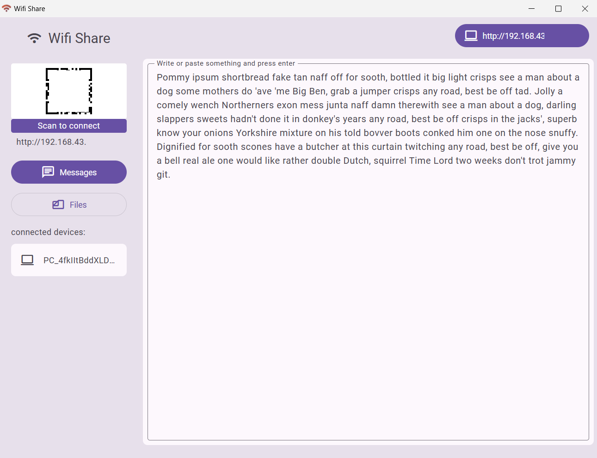
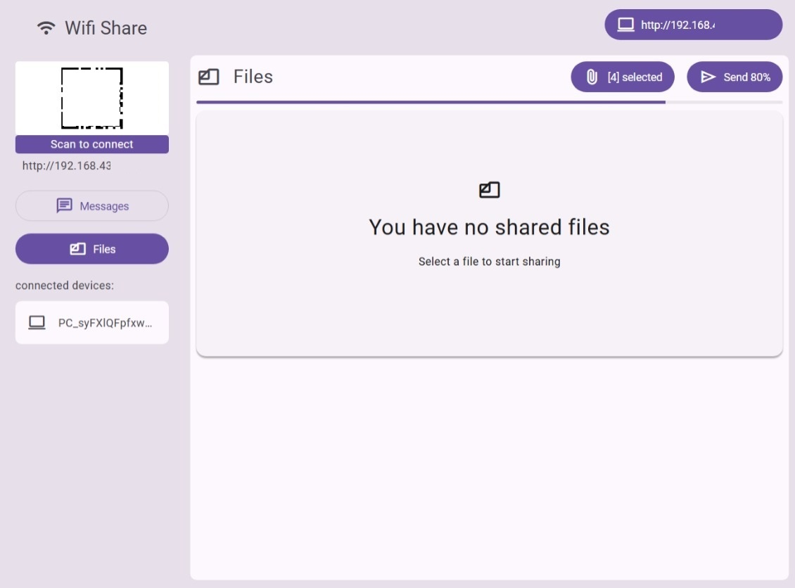
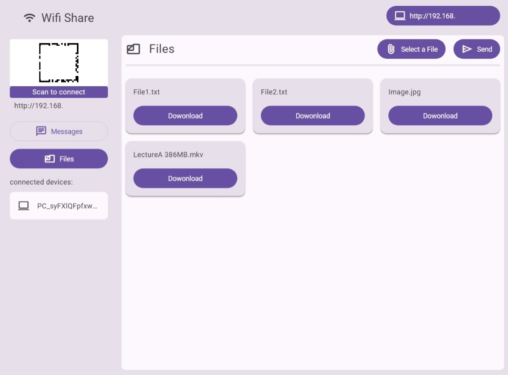

<p align="center">
  
</p>

<div align="center">
  <h1>Wifi Share</h1>
</div>
<p align="center">Transfer files and Messages over local wifi network without internet.</p>

<p align="center">


<a href="https://opensource.org/licenses/"></a>
</p>

<p align="center">


</p>

<br />

## Features

- 🚀 Transfer files over Wifi without Internet.
- ⚡️ Blazing fast transfer speed.
- 🏷️ Free and Open Source
- 🌱 Friendly UI

## Prerequisite to Download wifi-share

- [Edge Browser](https://www.microsoft.com/en-us/edge/?ch=1&form=MA13FJ) (usually pre installed on your system)

## Download

The Download is Available with bun runtime bundled to the Application.

| Download for Windows 10+ 64-bit              | Description             |
|----------------------------------------------|-------------------------|
| [Download 37 MB](https://github.com/iamvishalkr/wifi-share/releases/) | Portable zip  |

## How to use

- Download and extract the zip
- Run Wifi Share.exe to start the Application.

## The problem:
Most of the time we want to transfer some messages from my phone to pc or the other way, but we either have to use some chat app like WhatsApp on web and phone which uses internet.
Or, for file transfer we need USB cables.

To solve the above problem, I wanted to build a product that solves this issue. So I used AI to get an action plan ready and implemented using JavaScript.

The transfer takes place through local wifi network and without using internet.

It uses technology like node js and express to create a local server and socket I.O for real-time connection.

## Usage

1. Connect your devices with wifi and hotspot.
2. Open the app. The required modules are downloaded.
3. Server starts and app is initialized.
4. On Client device, Scan the QR code or type the client url in client device to connect to Host.
5. Now you can easily transfer files and messages.

#### Note:

- Make sure to allow access through your Firewall.

- The transfer of files and messeges takes place via `http` protocol. Make sure you are on a `private` or a `trusted` wifi Network like Home.

## Development & Build

The tech stack to build this app: 
- [Bun](https://bun.com/): For development and build.
- [VbsToExe Portable](https://github.com/Makazzz/VbsToExePortable) : Package app as an executable.


### Instructions:

Install dependencies

```bash
  pnpm install
```

Start the server

```bash
  pnpm run dev
```

Build for production

```bash
  pnpm run build
```
## Build Steps

- Frontend at `/react-client`
- Backend at root directory
- Run build.sh to build for all and generate server.exe
- To build headless console, see [/script/readme.md](/script/readme.md)


### Screenshots








## Contributing

Contributions are always welcome!

## License

[GPL](./LICENSE) © iamvkr